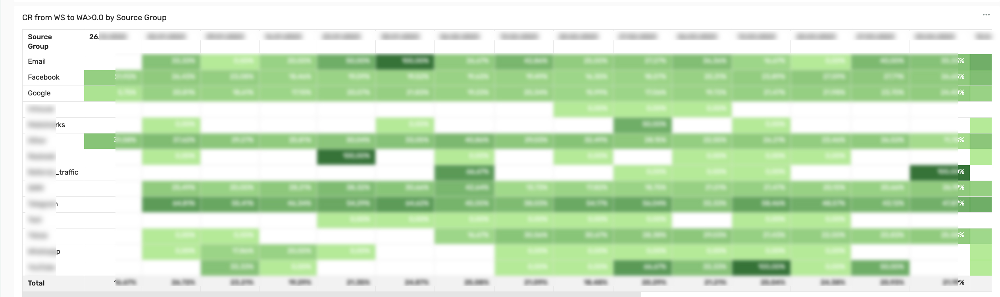

## Webinar funnel dashboard (work project)

This is a data visualization project for one of the companies (data blurred).
- **Stakeholders:** CMO, CEO.
- **Users:** commercial department.
- **Deadlines:** Iteration 1 release - 1 day, improvements - constantly.
- **Business sense:** reflects the attendance statistics for each individual webinar, as well as generalized data by courses and languages. Different teams, as well as analysts themselves, need a tool to access the data they need to develop recommendations and make decisions.
- **My role:** data acquisition, data processing, connecting data sources to the GDS, joining tables, visualization. Last iteration - managing all the processes

We launched a webinar funnel. But how to know how things are going? How many people **signed up** for the webinar, and how many **came** to it? Where to look to see these banal numbers, which are so necessary for understanding the situation and making decisions?

One service was used to register for the webinar. To conduct webinars - another one. But the entire project team cannot monitor these services to keep track of the numbers - this is inconvenient. Need a dashboard. To do it wisely, you need to integrate these data sources with DWH, and from there transfer the data to the visualization program. But there is no development resource available. 

Business can't wait. What should I do to complete the task?

### Iteration 1. 

Every day I opened webinar services, write down the numbers in a Google spreadsheet, and calculate the CRs.

+++ fast implementation

--- a lot of manual labor. I mpossible to scale. The human factor leads to errors. Inflexibility and low detail of data.

### Iteration 2. 

Every day I open webinar services, download tables with data, store them in **Google spreadsheets**, process and join the data with formulas, calculate the CRs.

+++ I spend a little less time

--- in a table it is not convenient to build different slices based on data

### Iteration 3. 

Grow Team automated uploading from one of the webinar services to Google spreadsheet using a low-code tool after I insisted. I connected Google spreadsheets storing data on webinar registrations and visits to the **Google data studio** (visualization tool). I put together the dashboard by my own.

+++ It’s convenient to work with data in the dashboard. Lots of filters, lots of graphs and tables. They cover all user requests, and it’s very easy to add new visuals.

--- still have to manually download data from registration service every day.

### Iteration 4.  

Two webinar services were replaced by new one. DWH appeared. I already have 2 analysts under direct subordination and 1 under project subordination. I secured the allocation of development resources for integrations. Drew up technical requirements for them: what specific data and how often do we need to transfer from BigMarker to the DWH. Created a task in Jira, where wrote down these requirements. Met with the developers product manager - the task was taken into a sprint. 

After 2 weeks the integrations were implemented. My analysts checked the data - everything was in order. Compiled the terms of reference for one of the analysts for creating a dataset in PostgreSQL, and the terms of reference for another analyst for visualization in **Double cloud**. Controlled the process, checked the result - done.

+++ data is updated automatically every morning

+++ dashboards are convenient and cover key user requests.

^^^ Here we can see data for each individual webinar: date and time, live or recorded format, region, course, webinar status, day of the week. The number of registrations, the number of webinar visits (lasting more than zero seconds, 5 minutes, 30 minutes and all), various conversions from registrations to visits, as well as the number of views of recordings.

! The webinar at 21:00 stands out. It does not have a high CR, but it has a lot of registrations, and due to this - visits. Why did many times more people sign up for it than usual? There's a lot to explore here.

^^^ Here we see a table with data on webinars, grouped by region and week. The heat map helps us to evaluate the dynamics of indicators and compare by region. The graphs reflect the general dynamics on a weekly basis without breakdown by region.

^^^ This is a very useful table. It shows how conversions differed across different traffic sources over the same period of time, as well as dynamics. Once this dashboard helped me figure out the reason for the drop in conversion (it lay in the launch of a new traffic source).

This dashboard can and should be developed, so it will be continued (without me, because I quit).
